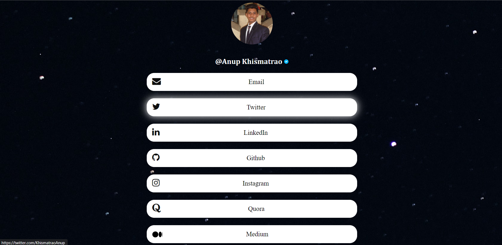

# :rocket: Social-Media-Reference-Landing-Page
  This repository is a social media reference landing page. Similar to [Linktree](https://linktr.ee/).
  This site is currently hosted through Netlify

## Screenshot


[Click here](https://social-landingpage.netlify.app/) to view the live demo. 
<p align="center">
    
</p>

## Technologies Used
  ➡️ HTML
  <br>
  ➡️ CSS

## 💻How to Run & Edit it Locally

To run this application on web, at least one web browser is installed on your computer.

```bash
# Clone this repository or download it.
$ git clone https://github.com/AnupK1234/Social-Media-Reference-Landing-Page

# Double click the index.html and open it in visual studio code or another IDE you use to edit it!

```
## 🤝 Contribution
I really appreciate contributions, issues and feature requests because this application is far from perfect. Feel free to pull requests and make changes to this project.

Since I finished this project myself, but there are many features and many things that can be improved, I really appreciate your help.
## License
[MIT License](https://github.com/AnupK1234/Social-Media-Reference-Landing-Page/blob/main/LICENSE)
